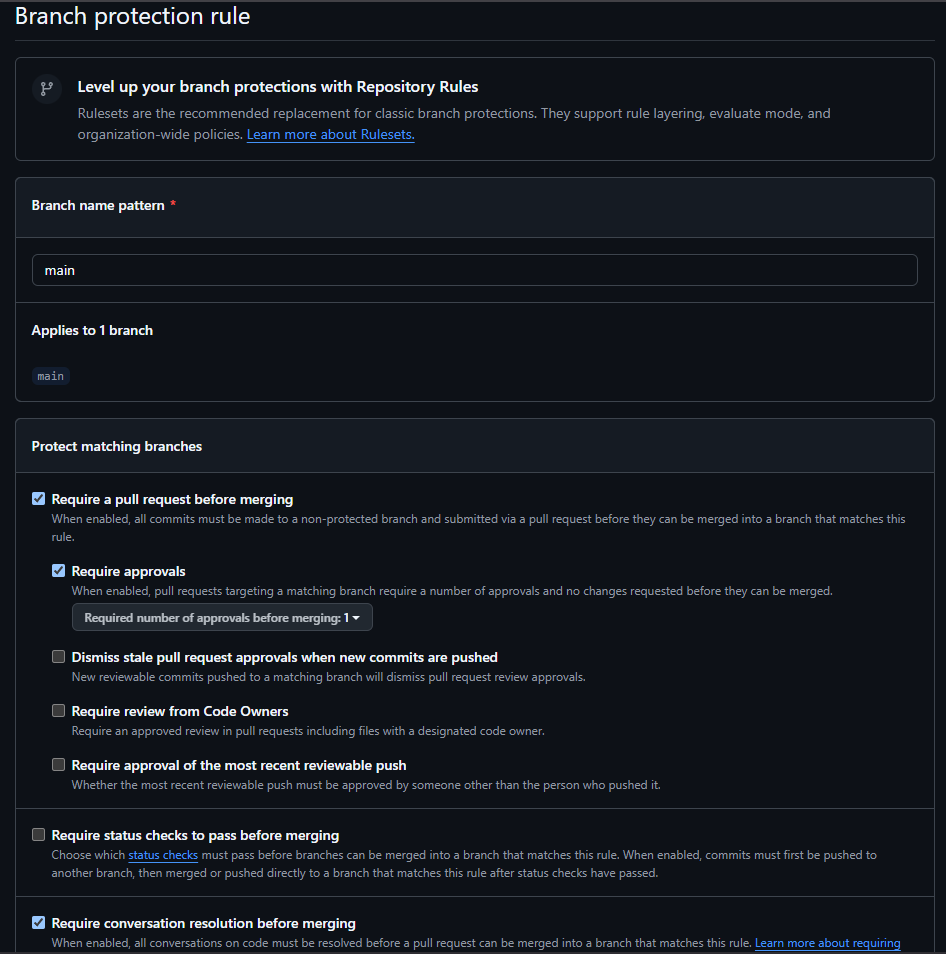
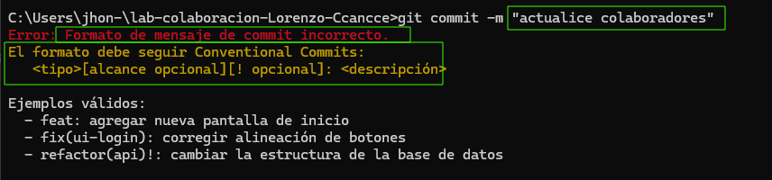
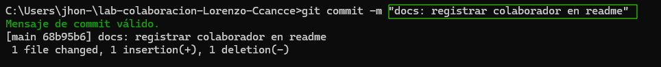

# Laboratorio: Gestión de proyectos con Git y GitHub

Repositorio del laboratorio de Desarrollo de Software.

**Estudiante:** Lorenzo Ccancce, Jhon Adelmo  
**Repositorio:** [lab-colaboracion-Lorenzo-Ccancce](https://github.com/Jhon-Lorenzo/lab-colaboracion-Lorenzo-Ccancce)

---

## Evidencias

### 1. Protección de la rama main
Captura de pantalla de las reglas de protección configuradas en GitHub (`Settings > Branches > Branch protection rules`):

---

### 2. Validación de Git Hooks (commit-msg)

#### Error por formato incorrecto
Captura del mensaje de error al intentar realizar un commit con un formato que no cumple con Conventional Commits:

#### Éxito con Conventional Commits
Captura del mensaje de validación exitosa al realizar el commit siguiendo el estándar Conventional Commits:

---

## Colaboradores
Lista de compañeros que participan en la dinámica de colaboración:

- *Jhon Lorenzo Ccancce*
